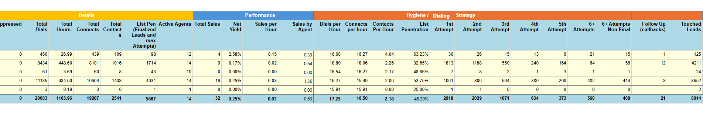
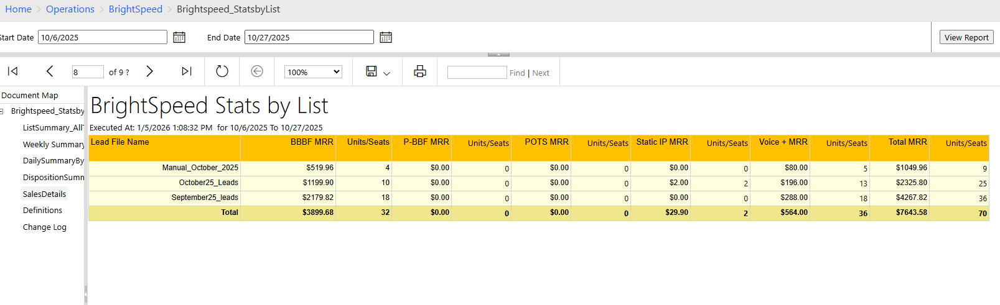
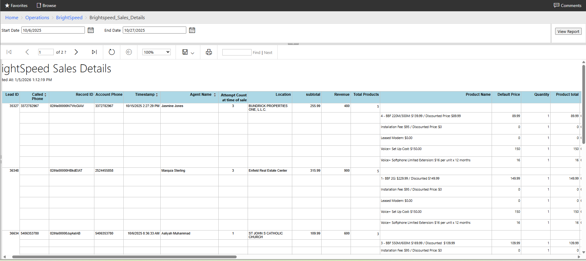
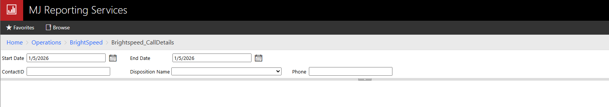
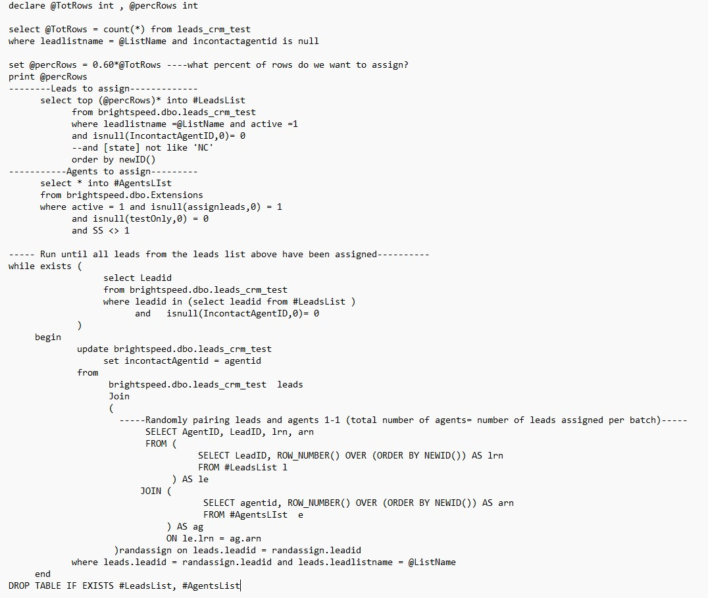

# Brightspeed Outbound Sales reports

### Task: Create reports following specified formatting to show outbound metrics such as lead count, dials, attempts and sales by list. 

[Sql Code for List Stats by Day/Week/Overall](..//Brightspeed/Files/Brspd_ListDetailsbyDay_week_overall.sql)

##### Attempts count was difficult to determine due to differing definitions but ultimately they wanted the attempts to match overall dial count for the time period selected.
------------------------------------------
#### Show Sales counts and MRR 

[Sql Code for Sale details in List stats report](../Brightspeed/Files/Brspd_SalesSummary.sql)

-----------------------------------------------------------------------------------------------------------------
### Report to show product sales with overall quantity and price

[SQL code for Sales Products](..//Brightspeed/Files/Brspd_SalesDetails.sql)

##### Grouping data to show overall sales stats by LeadID but with a break down of products and quantity/price
-----------------------------------------------------------------------------------------------------------------
### Report requirements to allow filtering by Record ID, Disposition, or phone number to look up customer calls.

[SQL code for Call Details](../Brightspeed/Files/Brspd_CallDetails.sql)

##### I included the filters in the report parameters in order to bypass the filter (parameter = null) and show all rows if  no filter was selected.
-----------------------------------------------------------------------------------------------------------------
### Lead Reassignment query
##### Screenshot of a query I developed to randomly assign a percentage of leads to a selectiong of agents.
This enabled us to only assign some leads for agents to call while keeping the other leads unassigned until needed. The task required a temporary table to hold a subset of leads to prevent needing to define the leads subset multiple times throughout the query. I used AI to help determine how to randomly match each item in the subset of leads to a random agent and then looped through the lead list subset so that each agent was assigned  around the same number of leads. 

